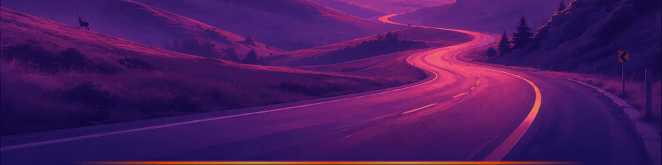
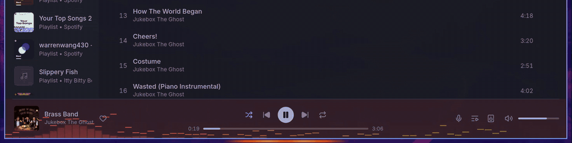

# Lightbar

A light strip for [Omarchy](https://omarchy.org/) that lives in the gap between
your tiled windows and the edge of the screen. It pulses outward from the centre
on every beat of whatever is playing and takes its colors from the cover art.



- Follows the kick and bass, not just overall loudness.
- Colors come from the current track's cover art, falling back to your theme accent.
- Sits under your windows: tiled windows leave it visible, floating and fullscreen windows cover it.
- Costs nothing when nothing is playing, and pauses while a fullscreen window hides it.



## Install

```bash
omarchy plugin add https://github.com/cole-robertson/omarchy-lightbar.git --enable
```

That is all. There is nothing to build and nothing extra to install.

To update or remove it later:

```bash
omarchy plugin update cole-robertson.lightbar
omarchy plugin remove cole-robertson.lightbar
```

## Settings

Add keys to the plugin's entry under `plugins` in `~/.config/omarchy/shell.json`:

```json
{ "id": "cole-robertson.lightbar", "edges": "bottom", "thickness": 4 }
```

| Key | Default | What it does |
|---|---|---|
| `edges` | `"bottom"` | `"bottom"`, `"top"`, `"left"`, `"right"`, a list of those, or `"all"` |
| `thickness` | `4` | Strip thickness in pixels |
| `sensitivity` | `1` | Scales how far each beat throws the bar |
| `colors` | `"art"` | `"theme"` ignores cover art and uses the theme accent |
| `glow` | `true` | `false` draws a hard-edged strip |
| `fps` | 50, or 30 on battery | Updates per second; lower is lighter on the compositor |
| `pauseOnBattery` | `false` | `true` only runs while plugged in |

Changes apply as soon as you save. `omarchy-shell lightbar status` prints the current state.

## How it works

`Service.qml` runs inside the Omarchy shell and only makes decisions: it watches
MPRIS for a playing track, picks colors from the cover art, and starts or stops
the renderer.

`lightbar.py` is the renderer, a single dependency-free Python script that speaks
the Wayland protocol directly. It captures the default audio output at 2 kHz
through `pw-cat`, low-passes it at 150 Hz, and turns bass onsets into bar motion.
The gradient is drawn once into a small buffer; on each beat the compositor
stretches and fades it, so the script never touches pixels while music plays.
It uses about 1.5% of one CPU core, and nothing runs when no music is playing.

The audio capture is a recording stream on your output, so Omarchy's optional
microphone bar widget may show the microphone as in use while music plays.

## Requirements

Omarchy 4 on Hyprland with PipeWire (`pw-cat`), `python3` and `curl`, all of
which ship with Omarchy.

## License

MIT
